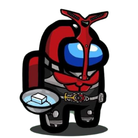

# Hello, I'm Popu :#3 

<a href=https://www.facebook.com/thinh.phu.353250>  </a>

My name is Popu and I'm studying Saigon University.  
I'm from Vietnam and my goal is to become a software engineer.

```js
class Popu {
  constructor() {
    this.fullName = "Chau Phu Thinh";
    this.school = "SGU K20";
    this.hobbies = ["coding", "anime"];
  }

  eat() {
    console.log("I eat everything that can be eaten");
  }

  coding() {
    console.log("I don't need anyone but Code");
  }

  sleep() {
    console.log("zzz....");
  }
}
```

<p align=center ></p>

## Frameworks - Platforms - Libraries:

    

## Languages

       

## Orther

 

## Github Stats

<p aling=center>


[](https://git.io/streak-stats)


</p>
